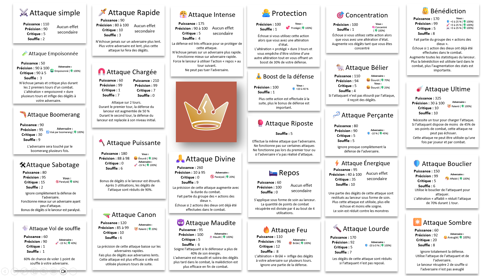

# 5.1.5

### Commande ajoutée :

Aucune nouvelle commande n'a été ajoutée lors de cette mise à jour.

### Autres ajouts :

* Augmentation de la durée maximale des combats de 24 à 26 tours
* Mise à jour des textes d'aide des attaques dans le jeu pour sir Rowan et la commande /infosclasses
* Mise à jour des liens d'aide visuelle pour les combats dans la commande aide

<figure><figcaption></figcaption></figure>

* Ajout d'un nouvel objet d'attaque
* Divers équilibrages des classes

```
Chevalier et ses variantes : Énergie légèrement réduite, défense réduite
```

* Divers équilibrages des attaques :

```
Attaque sombre: Coût en souffle augmenté de 6 à 8, dégâts augmentés, critique réduit de 35% à 20%, prise en compte partielle de la défense adverse
Attaque lourde : Mécanisme complètement remanié et suppression du mécanisme d'echec lié à la défense de l'adversaire - fonctionne mieux après s'être reposé, réduction de défense variable selon le nombre d'utilisations (20%, 10%, 5% puis plus d'effet), calcul des dégâts mis à jour pour être plus efficace à transpercer l'armure mais plus soumis à la vitesse
Attaque puissante : Précision améliorée pour les joueurs de haut niveau (réduction progressive de l'échec de 12% à 2% entre les niveaux 90 et 130)
```

* Améliorations des IA des classes suivantes

<pre class="language-markdown"><code class="lang-markdown"># Chevalier et ses variantes : 
Ajout de variabilité dans l'utilisation de l'attaque rapide
Nouvelle stratégie d'attaque lourde après repos, gestion améliorée du repos
optimisation des bénédictions et du repos
<strong># Canonnier et ses variantes :
</strong><strong>Amélioration de la logique de chaînage d'attaques canon et des attaques de finition
</strong>Optimisation des séquences d'attaques canon et de boomerang
Améliorations similaires au lanceur de pierres avec focus sur le sabotage
<strong># Fantassin et ses variantes :
</strong><strong>Amélioration de la prédiction des charges adverses
</strong><strong># Mage mystique :
</strong><strong>Refonte complète de la stratégie d'utilisation des attaques
</strong><strong>Timing amélioré pour l'attaque maudite
</strong># Paladin et ses variantes :
Amélioration de la stratégie d'attaque divine et bouclier
Meilleure gestion des attaques ultimes
<strong># Vétéran et ses variantes :
</strong><strong>Amélioration de la prédiction des charges adverses incluant le repos stratégique
</strong></code></pre>

### Bugs corrigés :

* Le prix de la régénération d'énergie n'était pas correct dans le shop dans certaines conditions [https://github.com/Crownicles/Crownicles/issues/3504](https://github.com/Crownicles/Crownicles/issues/3504)
* La commande /vendre ne fonctionnait pas avec certains boucliers dans l'inventaire [https://github.com/Crownicles/Crownicles/issues/3523](https://github.com/Crownicles/Crownicles/issues/3523)
* Les aînés de guilde n'avaient pas certaines permissions qu'ils auraient dû avoir [https://github.com/Crownicles/Crownicles/issues/3525](https://github.com/Crownicles/Crownicles/issues/3525)
* L'attaque à droite et à gauche ne fonctionnait pas correctement [https://github.com/Crownicles/Crownicles/issues/3531](https://github.com/Crownicles/Crownicles/issues/3531)
* La commande aide ne décrivait pas le fonctionnement actuel des notifications [https://github.com/Crownicles/Crownicles/issues/3540](https://github.com/Crownicles/Crownicles/issues/3540)
* Le message d'erreur hors classement ne fonctionnait pas pour le classement de la semaine [https://github.com/Crownicles/Crownicles/issues/3536](https://github.com/Crownicles/Crownicles/issues/3536)
