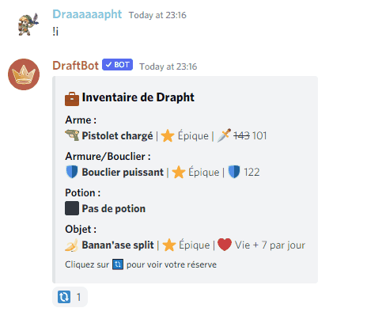

# 2.2.2

### Commandes ajoutées :

Aucune nouvelle commande n'a été ajoutée dans cette mise à jour.

### Autres ajouts :

* La réserve peut désormais stocker plus d'équipements grâce à l'achat d'emplacements supplémentaires.&#x20;

.png>)

* Les interfaces des commandes `!inventory`, `!sell` et `!switch` ont été revues.&#x20;

* Il est désormais possible de vendre des armes ou des armures.

.png>)

* Le message affichant la nouvelle destination d'un joueur affiche également la durée de son nouveau trajet.&#x20;

.png>)

* Ajout d'un mini-évènement utilisant l'API de la NASA !

.png>)

* Ajout d'un mini-évènement permettant de gagner du temps.

 (1).png>)

* Ajout de 3 nouveaux évents.&#x20;


Plus de détails sur la rédaction des évènements du bot sont disponibles ici


* Ajout d'un mini-évènement permettant de jouer à une loterie.

.png>)

* Les joueurs que vous croisez dans votre aventure vous afficheront leur classement pour que vous puissiez regarder leur profile.

.png>)

* Ajout d'alias pour la commande `!classstats`.
* Ajout d'informations sur le type d'objet sur le mini-évènement du petit magasin.&#x20;
* La base de donnée est maintenant sauvegardée automatiquement de manière bien plus sécurisée.
* Les pastilles bleues dans les classements affichent à nouveau si un joueur est présent sur le serveur où la commande est effectuée.&#x20;
* Les classements affichent le lieu où les joueurs se trouvent lorsqu'ils sont arrivés à destination.&#x20;

.png>)

* Mise à jour de certains conseils qui étaient faux.&#x20;
* Suppression de deux issues qui tuaient le joueur de manière injuste.
* Simplification du don de récompense pour les gagnants de tournois.&#x20;
* Mise à jour des librairies utilisées par le bot pour accéder aux nouvelles fonctionnalités. L'inventaire affiche désormais quand un équipement ne peut pas être utilisé à sa pleine puissance par un joueur.&#x20;
* Ajout de deux nouveaux équipements.&#x20;
* Le bot peut désormais rejoindre des threads et répondre aux commandes dans ces derniers.
* Les équipements qui ne sont pas utilisés à pleines puissances affichent désormais la puissance utilisable par le joueur.

.png>)


Pour plus d'informations sur les limitations de puissances des objets, nous vous invitons à consulter cette page du guide du bot. [https://guide.draftbot.com/notions-principale/items](https://guide.draftbot.com/notions-principale/items)


### Correction de bugs :

* Blockedplayer arraylist issues : [https://github.com/DraftBot-A-Discord-Adventure/DraftBot/issues/558](https://github.com/DraftBot-A-Discord-Adventure/DraftBot/issues/558)&#x20;
* Possibilité d'aller en négatif pour l'argent : [https://github.com/DraftBot-A-Discord-Adventure/DraftBot/issues/552](https://github.com/DraftBot-A-Discord-Adventure/DraftBot/issues/552)&#x20;
* Les avancements de temps ne marchent pas sur les mini-events : [https://github.com/DraftBot-A-Discord-Adventure/DraftBot/issues/542](https://github.com/DraftBot-A-Discord-Adventure/DraftBot/issues/542)
* Bug possibilité de transfert un pet fielleux en utilisant la commande ptr \<num> : [https://github.com/DraftBot-A-Discord-Adventure/DraftBot/issues/537](https://github.com/DraftBot-A-Discord-Adventure/DraftBot/issues/537)&#x20;
* Réparer les fights qui ont été cassés par discordjs : [https://github.com/DraftBot-A-Discord-Adventure/DraftBot/issues/528](https://github.com/DraftBot-A-Discord-Adventure/DraftBot/issues/528)
