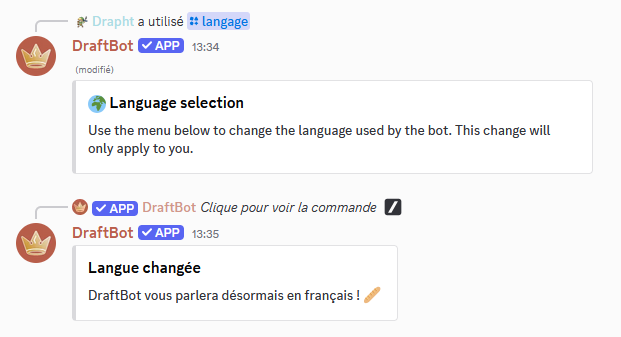
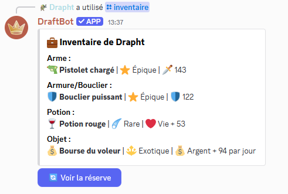
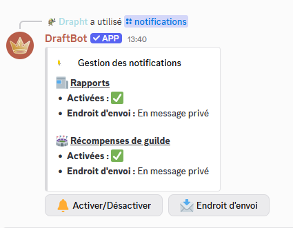

# 5.0.0

### Commande ajoutée :

Aucune nouvelle commande n'a été ajoutée lors de cette mise à jour.

### Autres ajouts :

* Refonte complète de l'architecture du code
* Ajout d'un nouveau système de traduction permettant le support de plus de langues
* La commande `language` est désormais individuelle au lieu de par serveur

<figure><figcaption><p>Vous pouvez nous aider à améliorer les traductions sur crowdin !</p></figcaption></figure>


La plateforme permettant de traduire DraftBot


* Amélioration des systèmes vérifiant la qualité du code
* Mise à jour de nombreuses commandes pour supporter les boutons au lieu des réactions

<figure><figcaption><p>DraftBot vis avec son temps <span data-gb-custom-inline data-tag="emoji" data-code="1f604">😄</span> On passe à l'ère des boutons !</p></figcaption></figure>

* Suppression du mini évent lié aux votes
* Amélioration de la gestion du blocage des joueurs sur certaines actions
* Améliorations de nos guides interne sur la mise en place de l'environnement de développement pour les nouveaux contributeurs
* Changement de licence du code du jeu (MIT -> AGPL3)


Le passage de la licence MIT à la licence AGPLv3 signifie plusieurs choses pour vous, en tant que joueurs :

* **Ouverture et transparence renforcées :** Le code source du jeu reste ouvert, ce qui vous permet (et aux développeurs tiers) d'étudier, modifier et redistribuer le logiciel.
* **Collaboration plus active :** Toute modification améliorant le jeu et diffusée publiquement doit être également partagée sous AGPLv3. Cela favorise une communauté collaborative et transparente.
* **Conditions plus strictes pour la redistribution :** Contrairement à la licence MIT, très permissive, l’AGPLv3 impose que toute version modifiée, même utilisée sur un serveur accessible à distance, reste libre et disponible pour l’ensemble de la communauté.

En résumé, ce changement vise à encourager une plus grande transparence dans l’évolution du jeu et à garantir que toutes les améliorations faites par la communauté restent accessibles à tous.


* Diverses mises à jour de sécurité de nos dépendances
* Suppression de la commande `prefix`
* Suppression de tous les profils des joueurs n'ayant pas terminé le tutoriel
* Ajout de quelques conseils
* Les "points de combat" sont désormais nommés de manière plus claire "énergie".
* Uniformisation des affichages d'emoji sur les mini évènements
* Suppression des mini évènements "il ne se passe rien" sur l'île
* Amélioration de la gestion des émojis dans les textes du jeu
* Légère modification des méthodes de calcul des récompenses des boss
* Les familiers fournissent désormais une assistance aux joueurs pendant les combats
* Le vétérinaire permet désormais de savoir quel est l'effet d'un familier
* Les joueurs rejoignant l'île recevront une compensation pour les points acquis durant leur trajet
* Divers ajouts, suppression et améliorations de commandes tests afin de simplifier le contrôle qualité du jeu
* Ajout d'un système de matchmaking permettant de trouver automatiquement un adversaire lors de l'utilisation de la commande `fight`
* La commande `fight` est désormais utilisable uniquement avec plus de 80 % de son énergie
* Modification du système de combat pour supporter un système basé sur des algorithmes de combat pour les joueurs afin de limiter la triche et permettre une plus grande disponibilité des adversaires
* Amélioration du système de gloire pour mieux supporter le nouveau système de matchmaking
* Perdre un combat fait maintenant perdre de la gloire
* Le classement par serveur a été supprimé
* Les pastilles bleues indiquant les joueurs sur le même serveur sur les classements ont été supprimées
* Il n'y a plus de compression de gloire à la fin de la saison de combat
* Ajustement des récompenses en fin de combat, ces derniers peuvent désormais rapporter des points et/ou de l'argent chaque jour en plus de la gloire
* Ajustement du nombre de points gagnés en fin de saison de combat dans les récompenses de ligue
* Suppression de la commande `pettrade`
* Suppression des combats amicaux
* Suppression de la météo dans les combats contre les monstres
* Le niveau minimal requis pour certaines attaques de monstre a été augmenté
* Petits ajustements de la durée de certains trajets liés à l'île
* Refonte de la méthode de calcul de l'énergie en fonction du niveau pour les joueurs et pour les monstres
* Refonte complète de la commande `notifications` qui permet maintenant beaucoup plus de contrôle

<figure><figcaption><p>Plus d'excuse pour ne pas faire vos rapports en temps et en heure</p></figcaption></figure>

* Ajouts de 7 nouveaux items dont 1 nouvelle potion, 2 armures, 3 armes et 1 objet
* Ajout de 39 attaques liées aux familiers
* Suppression de la possibilité d'utiliser :end: sur les mini évènements
*   Modifications des attaques de certains monstres :

    ```
    - Mutant vaseux :
      - Suppression des anciennes attaques du mutant vaseux.
      - Nouvelle attaque "Mimique magique" copie la dernière attaque de l'adversaire si elle est magique, sinon est identique à une attaque simple
      - Nouvelle attaque "Tir de boue" : Attaque à distance qui inflige des dégâts et rend l'adversaire sale.
      - Nouvelle attaque "Boue brûlante" : Chauffe la boue dans l'arène pour faire des dégâts aux adversaires sales.
      - Obtient également l'attaque empoisonnée
    - Squelette :
      - Attaque invocation retravaillée : Donne une altération permanente au lieu de faire des gros dégâts
    - Titan de magma :
      - Perte de l'attaque "Drain de chaleur", replacée par l'attaque feu.
      - Attaque erruption retravaillée : N'impacte plus la météo, fais de gros dégâts mais échoue plus souvent si adversaire très rapide.
    ```
*   Équilibrage de certaines classes :

    ```
    - Classe mage: 
      - Souffle max 15 -> 16
      - Vitesse 75 -> 25
    - Classe tank (et ses dérivés):
      - Attaque légèrement augmentée
      - Défense augmentée
    - Casqué:
      - Attaque bouclier disponible
    - Archer:
      - Attaque intense disponible
    ```
*   Équilibrage de certaines altérations d'état :

    ```
    - Nouvelle altération aveuglé : 80% de chance de ne pas attaquer, vitesse et défense réduites, 90% de chance de retrouver la vue après 1 tour
    - Brûlé : % chance de fin de brûlure modifiées: 
      - tour 2 : 60% -> 10%
      - tour 3 et + : 60% -> 80%
    - Retour de l'altération confus :
      - Dure 3 tours
      - 60% de chance d'utiliser une attaque aléatoire
      - 20% de chance de se blesser 
    - Nouvelle altération répugnant : Augmentation de l'attaque de 5%, 20 % de chance de se nettoyer chaque tour après 3 tours
    - Gelé : standardisation de la méthode de calcul des dégâts
    - Empoisonné : légère réduction des dégâts maximums
    - Ralentis : Durée augmentée (1 tour -> 2 tours)
    - Nouvelle altération avalé : 50 % de chance de ne pas attaquer pendant 2 tours (sinon 1 tour)
    rend l'adversaire répugnant si il est avalé pendant 2 tours
    - Affaibli : Durée augmentée (1 tour -> 2 tours)
    ```

<figure><figcaption><p>La nouvelle aide des attaques pour la V5</p></figcaption></figure>

*   Équilibrage de certaines attaques :

    ```
    - Attaque puissante :
      - Augmentation des dégâts (150 -> 180)
      - La réduction de vitesse de 15% s'applique à l'adversaire uniquement
      - Après 3 utilisations, les dégâts sont réduits à 90% (au lieu de 70%)
      - Taux de critique réduit (5% -> 0%)
      - Taux d'échec réduit (20% -> 12%)
    - Attaque énergétique :
      - Augmentation des dégâts (90 -> 95)
      - Coût en souffle passe de 8 à 10
      - Le taux d’échec augmente avec le nombre d’utilisations (uniquement pour le lanceur)
      - Énergie récupérée diminuée après la 3e utilisation
    - Attaque chargée :
      - Au 1er tour, taux de critique réduit (15% -> 1%)
      - Au 2nd tour, taux de critique réduit (15% -> 7%)
      - Augmentation des dégâts du 2nd tour (145 -> 210)
    - Attaque Canon :
      - Légère modification de la méthode de calcul des dégâts
    - Attaque Bélier :
      - Taux d’échec réduit (20% -> 6%)
      - Légère modification du calcul des dégâts
    - Attaque Bouclier :
      - Dégâts maximum augmentés
    - Attaque Ultime :
      - Taux de critique diminué (20% -> 10%)
    - Attaque Divine :
      - Légère modification de la méthode de calcul des dégâts
    - Attaque Empoisonnée :
      - N'échoue jamais pendant les 2 premier tour du combat
      - Taux de critique augmenté (5% -> 90%) sur les 2 premiers tours du combat
      - Dégâts de l'attaque impactés par l'armure
    - Attaque Feu :
      - Taux de critique réduit (20% -> 12%)
      - Taux d’échec réduit (20% -> 4%)
      - Dégâts augmentés à 110
    - Attaque Lourde :
      - Taux d'échec réduit (15% -> 8%)
    - Attaque Sombre :
      - Taux de critique réduit (40% -> 35%)
      - Taux d’échec réduit (15% -> 8%)
      - Dégâts réduits (175 -> 50)
      - Modification de la méthode de calcul des dégâts
      - Si l’adversaire a déjà une altération, rend 2 souffles au lanceur ; sinon, l’adversaire est aveuglé
      - Coût en souffle passe de 8 à 6
    - Attaque Intense :
      - Légère modification de la méthode de calcul des dégâts
    - Attaque Maudite :
      - Soigne le lanceur si l'adversaire a plus de 40% de sa vie
    - Bénédiction :
      - Augmentation des dégâts (100 -> 170)
      - Taux de critique réduit (10% -> 1%)
      - Réduction de l’augmentation des stats bénéfiques à 25% max
    - Concentration :
      - Augmentation du boost de dégâts
    ```

### Bugs corrigés :

* La perte d'énergie sur l'ile pendant un mini évènement, n'entrainais pas un départ de l'île [https://github.com/DraftBot-A-Discord-Adventure/DraftBot/issues/2864](https://github.com/DraftBot-A-Discord-Adventure/DraftBot/issues/2864)
* Les guildes de niveau max continuaient de remporter de l'xp [https://github.com/DraftBot-A-Discord-Adventure/DraftBot/issues/2841](https://github.com/DraftBot-A-Discord-Adventure/DraftBot/issues/2841)&#x20;
* Problèmes de gestions des alliés sur le bateau [https://github.com/DraftBot-A-Discord-Adventure/DraftBot/issues/2807](https://github.com/DraftBot-A-Discord-Adventure/DraftBot/issues/2807)&#x20;
* Duplication de certaines commandes [https://github.com/DraftBot-A-Discord-Adventure/DraftBot/issues/2589](https://github.com/DraftBot-A-Discord-Adventure/DraftBot/issues/2589)&#x20;
* Réagir à la place d'un autre joueur fonctionnait sur certains mini évènement [https://github.com/DraftBot-A-Discord-Adventure/DraftBot/issues/2588](https://github.com/DraftBot-A-Discord-Adventure/DraftBot/issues/2588)&#x20;
* Payer une charrette ne changeait pas forcément le trajet [https://github.com/DraftBot-A-Discord-Adventure/DraftBot/issues/2567](https://github.com/DraftBot-A-Discord-Adventure/DraftBot/issues/2567)&#x20;
* Rejoindre une guilde en étant sur le bateau [https://github.com/DraftBot-A-Discord-Adventure/DraftBot/issues/2563](https://github.com/DraftBot-A-Discord-Adventure/DraftBot/issues/2563)&#x20;
* Accepter des combats sur le bateau de retour de l'ile [https://github.com/DraftBot-A-Discord-Adventure/DraftBot/issues/2554](https://github.com/DraftBot-A-Discord-Adventure/DraftBot/issues/2554)&#x20;
* Il était possible de libérer un familier fielleux gratuitement [https://github.com/DraftBot-A-Discord-Adventure/DraftBot/issues/2545](https://github.com/DraftBot-A-Discord-Adventure/DraftBot/issues/2545)&#x20;
* Le mutant pouvait faire plusieurs bénédictions [https://github.com/DraftBot-A-Discord-Adventure/DraftBot/issues/2541](https://github.com/DraftBot-A-Discord-Adventure/DraftBot/issues/2541)&#x20;
* Problème de détection de dépense d'argent sur une mission quotidienne [https://github.com/DraftBot-A-Discord-Adventure/DraftBot/issues/2536](https://github.com/DraftBot-A-Discord-Adventure/DraftBot/issues/2536)&#x20;
* L'attaque sabotage avait un souci de calcul de dégâts [https://github.com/DraftBot-A-Discord-Adventure/DraftBot/issues/2528](https://github.com/DraftBot-A-Discord-Adventure/DraftBot/issues/2528)
* Problème de calcul des points remportés sur l'ile [https://github.com/DraftBot-A-Discord-Adventure/DraftBot/issues/2507](https://github.com/DraftBot-A-Discord-Adventure/DraftBot/issues/2507)
* Possibilité de faire deux combats simultanément [https://github.com/DraftBot-A-Discord-Adventure/DraftBot/issues/2483](https://github.com/DraftBot-A-Discord-Adventure/DraftBot/issues/2483)
* Notifications dupliquées [https://github.com/DraftBot-A-Discord-Adventure/DraftBot/issues/2437](https://github.com/DraftBot-A-Discord-Adventure/DraftBot/issues/2437)
* L'attaque puissante ne donnait pas le malus de vitesse au bon joueur [https://github.com/DraftBot-A-Discord-Adventure/DraftBot/issues/2404](https://github.com/DraftBot-A-Discord-Adventure/DraftBot/issues/2404)
* Mauvaise traduction d'un message [https://github.com/DraftBot-A-Discord-Adventure/DraftBot/issues/2396](https://github.com/DraftBot-A-Discord-Adventure/DraftBot/issues/2396)
* L'attaque repas de famille n'affichait pas clairement tous ses effets aux joueurs [https://github.com/DraftBot-A-Discord-Adventure/DraftBot/issues/2382](https://github.com/DraftBot-A-Discord-Adventure/DraftBot/issues/2382)
* Les familiers pouvaient disparaitre sans raison [https://github.com/DraftBot-A-Discord-Adventure/DraftBot/issues/2377](https://github.com/DraftBot-A-Discord-Adventure/DraftBot/issues/2377)
* Le mini évènement magasin pouvait changer l'objet obtenu entre son achat et la récupération par le joueur [https://github.com/DraftBot-A-Discord-Adventure/DraftBot/issues/2376](https://github.com/DraftBot-A-Discord-Adventure/DraftBot/issues/2376)
* Il était possible de recommencer un combat en supprimant le message du combat [https://github.com/DraftBot-A-Discord-Adventure/DraftBot/issues/2371](https://github.com/DraftBot-A-Discord-Adventure/DraftBot/issues/2371)
* Blocage des joueurs sans raison valables [https://github.com/DraftBot-A-Discord-Adventure/DraftBot/issues/2368](https://github.com/DraftBot-A-Discord-Adventure/DraftBot/issues/2368)
* Problème de notification sur la commande respawn [https://github.com/DraftBot-A-Discord-Adventure/DraftBot/issues/2293](https://github.com/DraftBot-A-Discord-Adventure/DraftBot/issues/2293)
* Collisions possibles des bases de données [https://github.com/DraftBot-A-Discord-Adventure/DraftBot/issues/2217](https://github.com/DraftBot-A-Discord-Adventure/DraftBot/issues/2217) ?
* Des erreurs apparaissaient dans les logs du bot[https://github.com/DraftBot-A-Discord-Adventure/DraftBot/issues/2175](https://github.com/DraftBot-A-Discord-Adventure/DraftBot/issues/2175) ?
* Si deux personnes achètent de l'xp de guilde en même temps, seul le deuxième montant est utilisé [https://github.com/DraftBot-A-Discord-Adventure/DraftBot/issues/2099](https://github.com/DraftBot-A-Discord-Adventure/DraftBot/issues/2099https:/github.com/DraftBot-A-Discord-Adventure/DraftBot/issues/2009https:/github.com/DraftBot-A-Discord-Adventure/DraftBot/issues/1866)
* Duplication de bonus ligue [https://github.com/DraftBot-A-Discord-Adventure/DraftBot/issues/2009](https://github.com/DraftBot-A-Discord-Adventure/DraftBot/issues/2099https:/github.com/DraftBot-A-Discord-Adventure/DraftBot/issues/2009https:/github.com/DraftBot-A-Discord-Adventure/DraftBot/issues/1866)
* Bonus de guilde journalier dupliqué [https://github.com/DraftBot-A-Discord-Adventure/DraftBot/issues/1866](https://github.com/DraftBot-A-Discord-Adventure/DraftBot/issues/2099https:/github.com/DraftBot-A-Discord-Adventure/DraftBot/issues/2009https:/github.com/DraftBot-A-Discord-Adventure/DraftBot/issues/1866)
* Mauvais affichage de la carte sur certains lieux [https://github.com/DraftBot-A-Discord-Adventure/DraftBot/issues/3079](https://github.com/DraftBot-A-Discord-Adventure/DraftBot/issues/3079)
