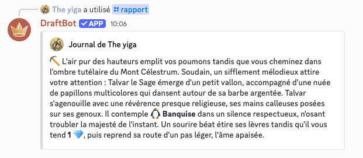

# 5.0.3

### Commande ajoutée :

Aucune nouvelle commande n'a été ajoutée lors de cette mise à jour.

### Autres ajouts :

* Améliorations diverses de traductions du jeu.
* Ajout d'un nouveau mini-évènement permettant aux joueurs d'obtenir des gemmes en visitant un nain amoureux des animaux dans la montagne.

<figure><figcaption>
Emmenez-lui vos animaux pour obtenir des gemmes !
</figcaption></figure>

* Ajout d'une notification quand un joueur vous attaque.

<figure><figcaption>
Maintenant, vous aurez des notifications quand on vous tape !
</figcaption></figure>

* Amélioration du système de matchmaking pour prioriser les joueurs actifs.
* Le transfert de gloire en fin de saison a été désactivé pour les joueurs ayant plus de 1400 points de gloire de défense.

### Bugs corrigés :

* Les combats pouvaient crash à cause de l'ia du fantassin [https://github.com/DraftBot-A-Discord-Adventure/DraftBot/issues/3318](https://github.com/DraftBot-A-Discord-Adventure/DraftBot/issues/3318)
* Oublie d'un tag sur l'event du brouillard [https://github.com/DraftBot-A-Discord-Adventure/DraftBot/issues/3332](https://github.com/DraftBot-A-Discord-Adventure/DraftBot/issues/3332)
* Les combats pouvaient crash à cause de l'ia du tank [https://github.com/DraftBot-A-Discord-Adventure/DraftBot/issues/3333](https://github.com/DraftBot-A-Discord-Adventure/DraftBot/issues/3333)
